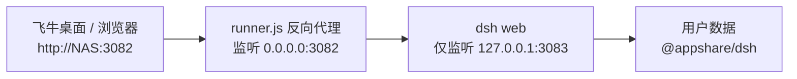

# DSH for fnOS

> 在飞牛 fnOS（trim）上运行 **DeepSeek Harness** 的第三方应用打包项目。
> 通过 GitHub Actions 自动拉取 [deepseek-ai/deepseek-harness](https://github.com/deepseek-ai/deepseek-harness) 最新源码构建，组装成 fnOS 应用壳并打出 `.fpk` 安装包，发布到 Release。

## 项目定位

本仓库**不改 DSH 源码**，只做三件事：

1. **构建**：CI 上拉上游 master 源码，`pnpm install + pnpm run build` 得到 DSH 本体
2. **组装**：把 DSH 本体 + fnOS 应用壳（manifest / cmd / config / wizard / ui / 图标）拼成完整应用目录
3. **打包**：`fnpack build` 产出 `.fpk`，发到 GitHub Release，NAS 上下载即装

## 目录结构

```
DSH/
├── appshell/            # fnOS 应用壳（打包用）
│   ├── manifest         # 应用元数据（appname=dsh，service_port=3082）
│   ├── cmd/             # 生命周期脚本（main 负责启停/状态）
│   ├── config/          # privilege（运行用户 dsh）+ resource（共享目录）
│   ├── wizard/install   # 安装向导（服务端口）
│   ├── ui/              # 桌面入口 config + 图标
│   ├── ICON.PNG         # 64x64 图标
│   └── ICON_256.PNG     # 256x256 图标
├── runner/
│   └── runner.js        # 运行器：启动 dsh web + 端口反向代理 + 认证/兼容处理
├── scripts/
│   └── assemble.sh      # 组装 DSH 本体进应用壳（供 Actions 调用）
├── .github/workflows/
│   └── build.yml        # 自动构建 + 发 Release
├── docs/BUILD.md        # 构建与发布说明
└── README.md
```

## 运行架构

采用**端口模式**接入，与飞牛桌面入口（`ui/config` 中的 `type=iframe`、`port=3082`）配合：



runner.js 承担三件事：

1. **启动 dsh web**：只监听回环地址，外部无法直连内部服务
2. **反向代理**：将 3082 的请求转发到内部 3083；WebSocket 同样透传
3. **两处适配**：
   - **认证**：预置 `browser-session` 密钥并自签 dsh 认证 cookie，浏览器无需处理 token 或登录跳转
   - **兼容**：HTML 注入 `crypto.randomUUID` polyfill（局域网 HTTP 属非安全上下文）

## 快速开始

### 构建全部交给 GitHub（NAS 零负担）

推送到 GitHub 后，Actions 每次手动触发或上游发版时自动构建并发布 Release。
本机性能不足完全不影响——构建、打包全在 GitHub 服务器上完成。

### NAS 上一键安装

Release 发布后，在 NAS 的 SSH 终端执行：

```bash
wget -O /tmp/DSH.fpk https://github.com/<你的用户名>/DSH_FNOS/releases/latest/download/DSH_v0.1.7-rc.2_all.fpk
sudo appcenter-cli install-fpk /tmp/DSH.fpk
```

也可在飞牛应用中心点击「手动安装」上传该文件。

- 安装向导中确认服务端口（默认 3082，与其他应用冲突时可更改）
- 装完桌面出现 DSH 卡片，点开即用
- 依赖：应用中心需已安装 `nodejs_v24` 运行时（manifest 已声明，缺失时应用中心会自动安装）

## 端口与数据

| 项目 | 说明 |
|------|------|
| 3082 | 对外服务端口，飞牛桌面入口与浏览器访问（向导可改） |
| 3083 | dsh web 内部端口，仅监听 127.0.0.1，由 runner 代理 |

数据目录位于共享目录 `/vol2/@appshare/dsh`（飞牛「文件管理 → 应用文件」可见、SMB 可访问）：

| 路径 | 内容 |
|------|------|
| `.dsh/` | DSH 配置、凭据、插件 profile（`DSH_HOME` 指向此处） |
| `Documents/` | 默认工作区所在文档目录（`XDG_DOCUMENTS_DIR`） |

日志位于 `/vol2/@appdata/dsh/dsh.log`。

## 应用内更新

对标官方桌面端的更新体验：**DSH 设置页会显示「版本更新」卡片**，
发现新版本时提示，点击即可下载并重启安装，全程无需 SSH、无需重打 fpk。

更新流程（与官方桌面端同一套状态机）：


更新只替换 `node_modules`，**应用壳（`bin/runner.js` 等）保持不动**，
因此本项目的 fnOS 兼容修复不会因更新丢失。

> 版本来源使用 npm 的 `next` 标签：上游 npm 的 `latest` 标签滞后于
> master 分支（实测 `latest=0.1.5-rc.3`、`next=0.1.7-rc.2`），
> 使用 `latest` 会导致降级。

## 与官方版的差异

| 项目 | 官方 deepseek-harness | 本项目 DSH |
|------|----------------------|-----------|
| appname | `deepseek-harness` | `dsh` |
| 服务端口 | 3080 | 3082（避开官方应用） |
| Node 运行时 | 自带约 125MB 二进制 | 复用应用中心 `nodejs_v24` |
| 版本 | 跟随打包时点 | CI 自动跟上游最新 |
| 数据目录 | 独立 | 独立，互不影响 |

## 构建细节

见 [docs/BUILD.md](docs/BUILD.md)。
